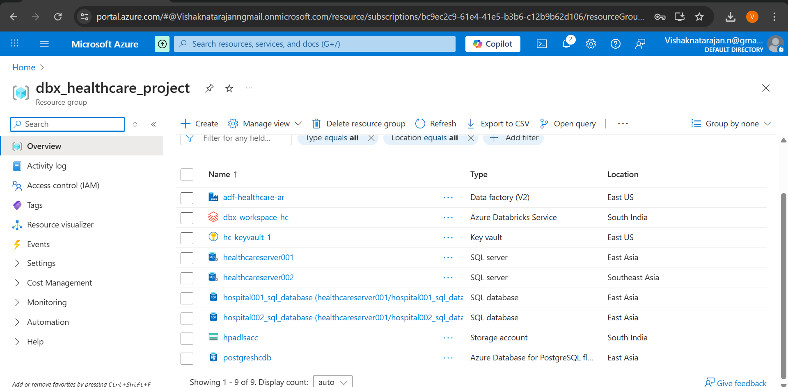

# 🏥💰🔷 Healthcare AR management using Azure Databricks
The Project `Healthcare AR management using Azure Databricks` aims for good cash flow in the Healthcare sector, by contributing to AR management with valuable data, which can be used to take better actions

## 📄Project Description:

In the Healthcare, **Account Receivable** (amount owed by patients or insurance company) should be managed properly.Because of the modern Low-payment Insurance policy, there are high deductibles and copay(amount paid by the patient) which leads to delay in payment or sometimes most likely not pay the amount, that directly affects the Heathcare organization. 

To avoid this, to have a good cash flow and to reduce the collection period, Account Receivable Management should be Implemented in the healthcare Organizations. For the effective AR management, it needs valuable data. This project focus to provide the quality and valueble data to the `AR Management team`. 

Thus,
- Collecting the data from the different sources
- By following the medallion Architecture, Cleaning & Enriching the data and implementing the **Common Data Model**  
- Finally, loading the data to the destination(`Datawarehouse`).

On top of this, we can perform analysis and get insights like patient with long due,patients who's not likely to pay based on the patterns. By understanding these things we can take actions like

- Appointing staff for:
   - Frequent follow-ups 🔁
   - Reminders ⏰
   - To guide and create awareness among patients 🧑‍⚕️📞

- Build models🤖 etc...

These measures will maintain a good cash flow in the organization, so that they invest in things that needed.

---

## 🧰 Tech Stack used

- **🔷 Azure Databricks** – for transformation
- **🔗 Azure Data Factory (ADF)** – for building pipelines and orchestration 
- **☁️ Azure Data Lake Storage** – Used for storage purpose 
- **🐙 GitHub** – Integrated with ADF for version control, collaboration, and as a source location
- **🤖 AskYourDatabase** - for conversational querying
- **🛢️ Azure SQL DB** - for storing source data

---
## Getting started 

Steps to intiate the project

### 🚀 Step 1: Create the required accounts
- 🌐 Create Azure account and the following services:
   - Azure Cloud – for storage (Storage Account)
   - Azure Databricks
   - Azure Data Factory
   - Azure SQL DB (2)
   - Azure KeyVault

- Create an AskYourDatabase account – for text-to-SQL querying on top of Snowflake

### 🧱 Step 2: Create the Schemas in both Azure SQL DB
- In the Azure account, after creating two Azure SQL Databases, load the EMR data into each of them
- Each will act as an OLTP database for the hospitals 🏥
- Each hospital (Azure SQL DB) should have EMR tables:
    - 👤 Patients
    - 🧑‍⚕️ Providers
    - 📅 Encounters
    - 🏬 Departments
    - 💳 Transactions

- This will serve as one of the source systems for the pipeline 📥

### Step 3: Create the Azure Container (ADLS)
- Create the required containers in the storage account
   -  Configs -> to store the load_config file
   - 📥landing -> files will be provided by the Insurance company (`Claims`)
   - 🟫bronze-> raw data from the SQL DB and landing container loaded here...
   - 🔘Silver -> After transformation(cleaning and CDM) from the bronze container loaded here..
   - 🥇gold -> After Dimensional Modeling from silver container files loaded here..
Bronze(parquet) -> Silver(Delta) -> Gold(Delta)

 By doing, medallion architure will be formed and storage will be created.

 ### Step 4: 🟫Bronze Layer
 - To bring the data into the Bronze layer ADF will be used.
     - #### Create Dataset in ADF
        - generic dataset that connect to Azure SQL DB, where the database,schema and table name will be passed as paramater while running the pipeline.
        - generic dataset in parquet format to connect with ADLS, here container, folder and file name will be passed as parameter while running the pipeline.
        - generic dataset in delimited format to connect with ADLS, same as above.
        - **Note:** generic dataset in delta format to connect with Azure Databrics Delta lake.

     - #### Create Linked services in ADF
        - common linked service to connect with ADLS(storage account)
        - common linked service to connect with AzureSQL DB)
        - common linked service to connect with Delta Lake
      
     - #### Create a pipeline for transfering data from `sqldb to bronze`
        - create a Lookup activity(Lkp_emr_configs) on configs file, which scans through each record and the pipeline will run based on the metadata
        - using the Foreach activity(ForEachRecord) on the output of Lookup, so each record will go through the ForEach.
        - Now, using the metadata activity(check_existence) to check if the file already exists or not
        - getmetadata activity(check_existence) checks for the location`bronze layer`(location allocated: by passing the parameter based on the config file Lookup activity((Lkp_emr_configs))
        - **In simple getmetadata activity tells if file exists already or not in bronze container, if present archiving it or transfering it in the bronze for the first time.**
      
        - Using if-condition activity(IfalreadyExists), if `True` from metadata activity then archiving it,other wise nothing.
        - archive location would be `archive/year/month/day/*.csv` either in datasource hos-a or hos-b.
        - On sucess of this if-condition(IfalreadyExists) following up with the another if-condition2(IfNotExists).
        - Where based on the output of the forEach(which scans each record of config file) If load_type column in record is full, then full load will be performed from the SQLDB.
        - Otherwsie, incremental load will be performed. This is what the second if-condition(IfNotExists) will be performihelng.
        - Inside the if-condition2(IfNotExists)
            - **Full** here use copy activity(copy_full_load) to pull the data from db and loaded into the bronze in parquet format
            - Also, after successfull operation. Will be maintaining the pipeline run as logs, again using the Lookup activity(full_load_logs).
            - Inserting into the delta table in databricks pulling required values from the output of the forEach(which scans each record of config file).
         
            - **Incremenatal** here as the data should be incrementally loaded before copying, a condition is used.
            - for that, again a lookup activity to find the max load_date column value from the load_log which is in the delta lake databricks.
            - if the only watermark column is greater than the load_date then only the files will be transfered/ copied to the bronze in parquet format.
            - Similar to the Full load, logs will be maintained in the delta table databricks.
         
      - **NOTE:** using the appropriate linked services & datasets whenever required and 
  
      - #### Create a Databricks Notebook for transfering data from `landing to bronze` and extracting the data using API
          - To Integrate Databricks with ADLS, create a service principle for accessing the file in ADLS from Databricks
          - create a claims notebook which reads the data from the landing container and combines the two different hospital files, also creating a new column datasource based on the hospital(hos-a/hos-b) and loading(overwriting) it to the bronze in parquet format.
          - create npi_extract note which pulls the data using api and load the data into the bronze in parquet format.
       
      - #### Now the bronze container looks like..
      - bronze
          - claims (holds both claims data from hos-a and hos-b)
          - npi_extract (holds npi related data)
          - hos-a
              - archive (archive/year/month/day/*.csv files)
              - 👤 Patients
              - 🧑‍⚕️ Providers
              - 📅 Encounters
              - 🏬 Departments
              - 💳 Transactions
          - hos-b
              - archive (archive/year/month/day/*.csv files)
              - 👤 Patients
              - 🧑‍⚕️ Providers
              - 📅 Encounters
              - 🏬 Departments
              - 💳 Transactions

      

 
  

