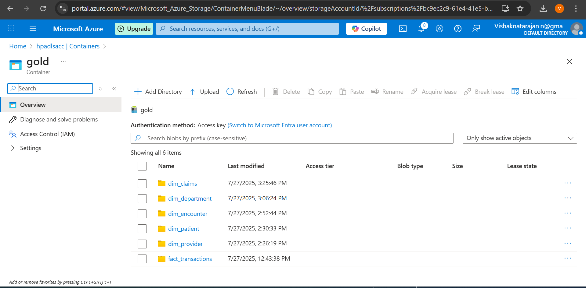

# 🏥💰🔷 Healthcare AR management using Azure Databricks
The Project `Healthcare AR management using Azure Databricks` aims for good cash flow in the Healthcare sector, by contributing to AR management with valuable data, which can be used to take better actions

## 📄Project Description:

In the Healthcare, **Account Receivable** (amount owed by patients or insurance company) should be managed properly.Because of the modern Low-payment Insurance policy, there are high deductibles and copay(amount paid by the patient) which leads to delay in payment or sometimes most likely not pay the amount, that directly affects the Heathcare organization. 

To avoid this, to have a good cash flow and to reduce the collection period, Account Receivable Management should be Implemented in the healthcare Organizations. For the effective AR management, it needs valuable data. This project focus to provide the quality and valueble data to the `AR Management team`. 

Thus,
- Collecting the data from the different sources
- By following the medallion Architecture, Cleaning & Enriching the data and implementing the **Common Data Model**  
- Finally, loading the data to the destination(`Datawarehouse`).

On top of this, we can perform analysis and get insights like patient with long due,patients who's not likely to pay based on the patterns. By understanding these things we can take actions like

- Appointing staff for:
   - Frequent follow-ups 🔁
   - Reminders ⏰
   - To guide and create awareness among patients 🧑‍⚕️📞

- Build models🤖 etc...

These measures will maintain a good cash flow in the organization, so that they invest in things that needed.

---

## 🧰 Tech Stack used

- **🔷 Azure Databricks** – for transformation
- **🔗 Azure Data Factory (ADF)** – for building pipelines and orchestration 
- **☁️ Azure Data Lake Storage** – Used for storage purpose 
- **🐙 GitHub** – Integrated with ADF for version control, collaboration, and as a source location
- **🤖 AskYourDatabase** - for conversational querying
- **🛢️ Azure SQL DB** - for storing source data

---
## Getting started 

Steps to intiate the project

### 🚀 Step 1: Create the required accounts
- 🌐 Create Azure account and the following services:
   - Azure Cloud – for storage (Storage Account)
   - Azure Databricks
   - Azure Data Factory
   - Azure SQL DB (2)
   - Azure KeyVault

- Create an AskYourDatabase account – for text-to-SQL querying on top of Snowflake

---

### 🧱 Step 2: Create the Schemas in both Azure SQL DB
- In the Azure account, after creating two Azure SQL Databases, load the EMR data into each of them
- Each will act as an OLTP database for the hospitals 🏥
- Each hospital (Azure SQL DB) should have EMR tables:
    - 👤 Patients
    - 🧑‍⚕️ Providers
    - 📅 Encounters
    - 🏬 Departments
    - 💳 Transactions

- This will serve as one of the source systems for the pipeline 📥

---

### Step 3: Create the Azure Container (ADLS)
- Create the required containers in the storage account
  
   -  Configs -> to store the load_config file
   - 📥landing -> files will be provided by the Insurance company (`Claims`)
   - 🟫bronze-> raw data from the SQL DB and landing container loaded here...
   - 🔘Silver -> After transformation(cleaning and CDM) from the bronze container loaded here..
   - 🥇gold -> After Dimensional Modeling from silver container files loaded here..
     
Bronze(parquet) -> Silver(Delta) -> Gold(Delta)

 By doing this, medallion architure will be formed and storage will be created.

 ---

 ### Step 4: 🟫Bronze Layer
 - To bring the data into the Bronze layer ADF will be used.
     - #### Create Dataset in ADF
        - generic dataset that connect to Azure SQL DB, where the database,schema and table name will be passed as paramater while running the pipeline.
        - generic dataset in parquet format to connect with ADLS, here container, folder and file name will be passed as parameter while running the pipeline.
        - generic dataset in delimited format to connect with ADLS, same as above.
        - **Note:** generic dataset in delta format to connect with Azure Databrics Delta lake.

     - #### Create Linked services in ADF
        - common linked service to connect with ADLS(storage account)
        - common linked service to connect with AzureSQL DB)
        - common linked service to connect with Delta Lake
      
     - #### Create a pipeline for transfering data from `sqldb to bronze`
        - create a Lookup activity(Lkp_emr_configs) on configs file, which scans through each record and the pipeline will run based on the metadata
        - using the Foreach activity(ForEachRecord) on the output of Lookup, so each record will go through the ForEach.
        - Now, using the metadata activity(check_existence) to check if the file already exists or not
        - getmetadata activity(check_existence) checks for the location`bronze layer`(location allocated: by passing the parameter based on the config file Lookup activity((Lkp_emr_configs))
        - **In simple getmetadata activity tells if file exists already or not in bronze container, if present archiving it or transfering it in the bronze for the first time.**
 
   
        - Using if-condition activity(IfalreadyExists), if `True` from metadata activity then archiving it,other wise nothing.
        - archive location would be `archive/year/month/day/*.csv` either in datasource hos-a or hos-b.
        - On sucess of this if-condition(IfalreadyExists) following up with the another if-condition2(IfNotExists).
        - Where based on the output of the forEach(which scans each record of config file) If load_type column in record is full, then full load will be performed from the SQLDB.
        - Otherwsie, incremental load will be performed. This is what the second if-condition(IfNotExists) will be performing.
        - Inside the if-condition2(IfNotExists)
          
        - **Full** here use copy activity(copy_full_load) to pull the data from db and loaded into the bronze in parquet format
        - Also, after successfull operation. Will be maintaining the pipeline run as logs, again using the Lookup activity(full_load_logs).
        - Inserting into the delta table in databricks pulling required values from the output of the forEach(which scans each record of config file).

         
        - **Incremenatal** here as the data should be incrementally loaded before copying, a condition is used.
        - for that, again a lookup activity to find the max load_date column value from the load_log which is in the delta lake databricks.
        - if the only watermark column is greater than the load_date then only the files will be transfered/ copied to the bronze in parquet format.
            - Similar to the Full load, logs will be maintained in the delta table databricks.
         
      - **NOTE:** using the appropriate linked services & datasets whenever required.

     
      - #### Create a Databricks Notebook for transfering data from `landing to bronze` and extracting the data using API
         - To Integrate Databricks with ADLS, create a service principle for accessing the file in ADLS from Databricks
         - create a claims notebook which reads the data from the landing container and combines the two different hospital files, also creating a new column datasource based on the hospital(hos-a/hos-b) and loading(overwriting) it to the bronze in parquet format.
         - create npi_extract note which pulls the data using api and load the data into the bronze in parquet format.

       
      - #### Now the bronze container looks like..
      - bronze
         - claims (holds both claims data from hos-a and hos-b)
         - npi_extract (holds npi related data)
         - hos-a
            - archive (archive/year/month/day/*.csv files)
            - 👤 Patients
            - 🧑‍⚕️ Providers
            - 📅 Encounters
            - 🏬 Departments
            - 💳 Transactions
          - hos-b
             - archive (archive/year/month/day/*.csv files)
             - 👤 Patients
             - 🧑‍⚕️ Providers
             - 📅 Encounters
             - 🏬 Departments
             - 💳 Transactions

           
---
                
### Step 5: 🔘Silver
  - To bring the data into the Silver layer Databricks will be used.
  - In the processing of pushing the data to the silver layer cleaning, enriching, common table model and SCD type 2 will be implemented.
  - As we have 7 different tables in the bronze container, it should be transformed using the notebooks(`Databricks`) and load into the silver container.
  - Based on the data quantity file will be loaded full or incremental.

  - In Databricks, creating a external delta table in databricks and the load the data from the bronze for each file.
  - Here, the external location will be the silver container of the ADLS.

  - **Full_load**
      - providers and departments table are goes through full load as they are small in size.
      - Notebooks are used to do the transformation and service principle code is used in each notebook to access file from the ADLS.
      - Firts the data will be read from the bronze from both hospitals and merged together.
      - Now creating a silver external delta table if not exists as already mentioned and truncating if previously any data is present.
      - Finally inserting the table into the table from the bronze layer.
      - This is process is done for both the files.
   
    - **SCD-Type2**
      - Other table in bronze container claims,NPI,transactions,encounters and patients undergo scd type 2.
      - Notebooks are used to do the transformation and service principle code is used in each notebook to access file from the ADLS.
      - Similaly data will be read from the bronze from both hospitals and merged together.
      - Now creating a silver external delta table if not exists.
      - Then creating a new temp view quality_checks where the data will go through an quality check.
        
      - If the record has any null values in any of the primary columns, it can be identified by either (True or false) in a new column is_quantrained.
      - Now merging the data into to the created silver external table based on the primary key equal condition and active_flag should be True.
      - If the condition satisfies, simply upading the record with active_flag = false and changing the date/time to current.
      - Then Inserting the new values/records to the data and updating the new records to the silver external table which is in the schema of the Databricks catalog.
      - This is process is done for all the files in the same way by implementing the SCD type-2 by using multiple notebooks.

      #### Now the silver container looks like..
      - silver
          - ├── 👤 Patients
          - ├── 🧑‍⚕️ Providers
          - ├── 📅 Encounters
          - ├── 🏬 Departments
          - ├── 💳 Transactions
          - ├── 📄 Claims
          - └── 🆔 NPI
       
---

### Step 6: 🥇Gold
  - To bring the data into the Gold layer same as silver Databricks will be used here.
  - In the processing of pushing the data to the gold layer star schema model will be implemented for analytical querying.
  - As we have 7 silver tables in the bronze container, for AR management 6 files will be loaded in the gold layer and forming a star schema
  - Everything will be done using the notebooks(`Databricks`) and load into the gold container.

  - Similar as the silver transfomation, creating a external delta table in databricks and the load the data from the silver for each file.
  - Here, the external location will be the gold container of the ADLS.

       - service principle code will be run, to access the adls files or we can directly read the silver tables
       - Here, the data will read from the silver location and enabling the temp view for the sql operations.
       - creating the external gold table if not exists
       - trucating it for every time to load the new data
         
       - selecting the only the requiured columns which will be useful for the business use case and using a condition
       - (i.e is_quantrained should be false) as we are only inserting the quality data for analysis.
       - Finally, inserting the data to the gold external table from the silver external table.
       - This is process is done for all the files in the same way by implementing the star schema model by using multiple notebooks.

   
      #### Now the Gold container looks like..
      - gold
          - ├── 👤 dim_patient
          - ├── 🧑‍⚕️ dim_providers
          - ├── 📅 dim_encounters
          - ├── 🏬 dim_departments
          - ├── 💳 dim_transactions
          - ├── 📄 dim_claims
          - └── 🆔 fact_transactions

       
---

### Step 7: Create a pipeline for transfering data from `brnz_slv_gold`
  - #### Create Linked services in ADF
       - Common linked service to connect with Databricks and that enables to use the notebook activity in the ADF pipeline
  
  - #### Create a pipeline that connect all the notebooks in a flow
       - **🟤 brnz_claims → ⚪ slv_claims → 🟡 gold_claims → 🟤 brnz_NPI → ⚪ slv_NPI → ⚪ slv_encounters → 🟡 gold_encounters → 
⚪ slv_patients → 🟡 gold_patients → ⚪ slv_transactions → 🟡 gold_transactions → ⚪ slv_departments → 🟡 gold_departments → ⚪ slv_providers → 🟡 gold_providers**
       - By connecting all the activity creating a proper flow using the Azure Data factory.

---
### Step 8: Create a master pipeline for complete workflow

   -  #### Create a pipeline that connect both the pipelines
       - using the executive pipeline activity connecting both of the pipelines, on success of the `sqldb_to_brnz` --> `brnz_to_slv_gold` will be initiated.
       - One after the other will be triggered and run.
 

---

## ▶️ Usage

Once everything has setup

1.**Triggering the master pipeline**
   - Running the pipeline manually or run it with any of the trigger.
 

2. **Master Pipeline flow**
   - once the pipeline triggered, ADF pipeline will be run based on the metadata(config file in config container).
   - If the file already exists archiving it first and then copying the file from any of the two sql database as per the metadata either incremental or full load
   - As per the number of records in the config file, pipeline will run and pushing the data to the bronze layer.
   - Once successfully compledted it will start the next pipeline starts
   - According to the above flow mentioned for databricks notebook, it will initiate and process one by one.
 

3. **Monitor Pipeline Execution**
   - Use the **Monitor** tab in ADF to track runs and debug any failures.
 
  
4. **Verify Output**
   - one completed, data will be present in the silver container as full load data or incremental data and
   - In Gold, data will be in star schema model.
   - Thus silver container can be used by down stream users like Data scientist, ML Engineers, AI Engineer etc..
   - Where the gold container is used by Data Analyst, BI developers and Stake Holders etc..

# Text to SQL Analytics using AskyourDatabase
### Sharing some screenshots

              
     
      
        

    
   
      

 
  

